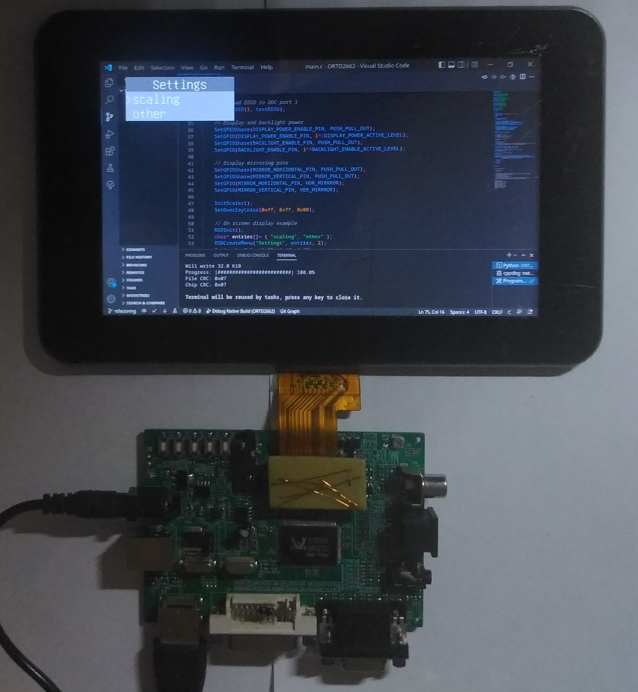

# ORTD2662

An (unsuccessful) attempt to create open source firmware for RTD2662 from scratch.

As of now it can (with manual adjustment):
- Use LVDS panels (TTL and RSDS untested)
- Display HDMI, DVI
- Display composite (AFAIK: NTSC only)
- Display VGA (with manual input clock adjustment)
- Scale up and down (in a somewhat narrow resolution range)
- Perform a limited input signal measuremnt
- Display simple OSD menu (no input though)
- Can be compiled for PC to allow debugging

# Modifying for your own board/panel

To allow this firmware to run on your board you will need to set:

- `DISPLAY_POWER_ENABLE_PIN`
- `DISPLAY_POWER_ACTIVE_LEVEL`
- `BACKLIGHT_ENABLE_PIN`
- `BACKLIGHT_ENABLE_ACTIVE_LEVEL`
- `MIRROR_VERTICAL_PIN`
- `MIRROR_HORIZONTAL_PIN`

in "config/board_config.h" file, and:

- `HOR_MIRRROR` 
- `VER_MIRRROR`

in "config/misc_config.h"

To allow this firmware to run with your board you will need to:
- write your panel configuration in "config/panel_config"
- using an EDID editor (for example [AW EDID Editor](https://www.analogway.com/americas/products/software-tools/aw-edid-editor/)) modify `testEDID[]` in "peripherals/ddc.c" to have your panel timings.
